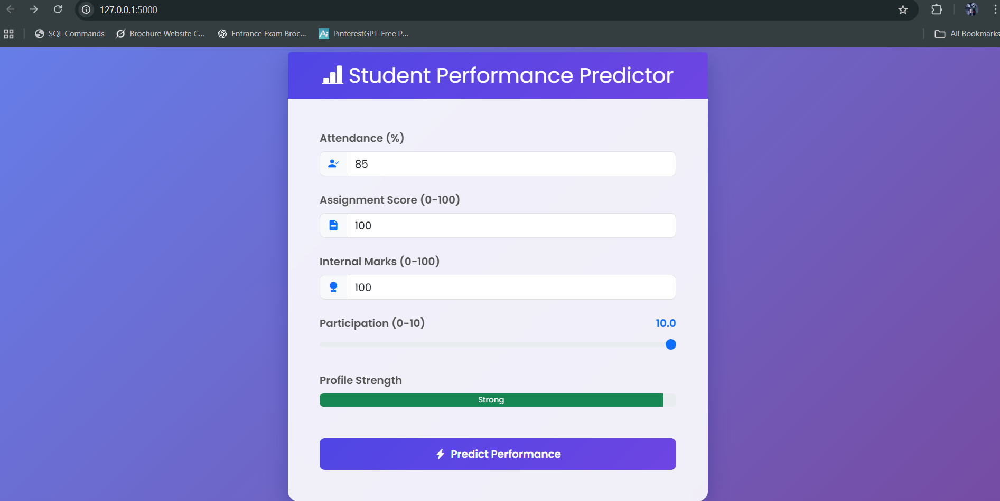
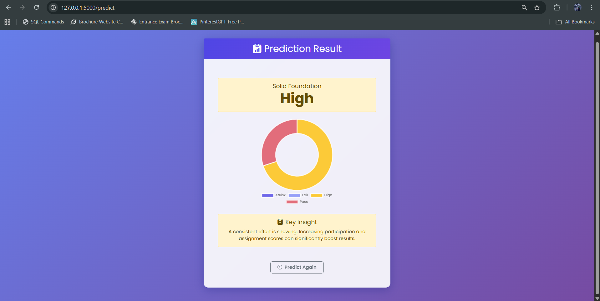

# 🎓 Student Performance Prediction (ML Web App)

A web application that uses machine learning to predict and analyze student academic performance.  
Teachers, students, and administrators can use this tool to gain insights, identify at-risk students, and intervene proactively.

---

## 📂 Repository Structure

```

student-performance-prediction-ml/
│
├── data/
│   └── students_sample.csv
│
├── models/
│   └── trained_model.pkl
│
├── output/
│   └── reports/
│
├── templates/
│   └── index.html, results.html
│
├── app.py
├── train.py
├── predict.py
├── requirements.txt
└── README.md

````

---

## 🚀 Features

- Upload student datasets (CSV)  
- Train ML models (Random Forest, Decision Tree, Logistic Regression)  
- Predict student performance  
- Visualize feature importance  
- Download result reports (PDF / Excel)  
- Role-based views: admin, teacher, student  
- Responsive web interface built with Flask + Bootstrap  

---

## 🧠 Dataset

- **File:** `students_sample.csv`  
- **Columns:**  
  - `student_id` → Unique identifier for each student  
  - `attendance` → Percentage of classes attended  
  - `assignment_score` → Average marks from assignments  
  - `internal_marks` → Internal exam scores  
  - `participation` → Class participation level (numeric/encoded)  
  - `previous_result` → Previous academic performance (grade or marks)  

- **Target / Label:**  
  Based on `internal_marks` and `previous_result`, the model predicts overall **student performance** (e.g., categories like *Pass / Fail / Excellent*).

---

## ⚙️ Installation & Setup

1. Clone the repository  
   ```bash
   git clone https://github.com/PrajwalN9741/student-performance-prediction-ml.git
   cd student-performance-prediction-ml


2. Create a virtual environment

   ```bash
   python -m venv venv
   source venv/bin/activate     # For Windows: venv\Scripts\activate
   ```

3. Install dependencies

   ```bash
   pip install -r requirements.txt
   ```

4. Train the model

   ```bash
   python train.py
   ```

5. Run the web application

   ```bash
   python app.py
   ```

6. Open in browser
   Navigate to `http://127.0.0.1:5000/`

---

## 🏞️ Screenshots

### 1. Home / Dashboard



### 2. Prediction Results



---

## 🎯 Usage Examples

* Teachers upload a `.csv` file of student features.
* The system runs predictions and displays which students may be at risk.
* Feature importance plots show which factors influenced the predictions more strongly.
* Reports can be exported and shared.

---

## 🧩 Tech Stack & Libraries

* **Backend:** Python, Flask
* **Data & ML:** Pandas, NumPy, Scikit-learn
* **Visualization:** Matplotlib, Seaborn
* **Frontend:** HTML, CSS, Bootstrap
* **Storage / File I/O:** Local file (optionally integrate a database later)

---

## ✅ Contribution & License

This project is open for contributions! Feel free to fork, submit issues, or create pull requests.

Licensed under the **MIT License** — see the `LICENSE` file for details.

---

## 👤 Author

**Prajwal N**
**Praveen H N**
GitHub: [PrajwalN9741](https://github.com/PrajwalN9741)
GitHub: [Praveen0916](https://github.com/Praveen0916)

---

### 📫 Connect with Me

[](https://www.linkedin.com/in/prajwal-n9741)  
[](https://www.instagram.com/_._ite_me_prajju.__)  
[](mailto:prajwalrajn9@gmail.com)  
[](https://github.com/PrajwalN9741)


